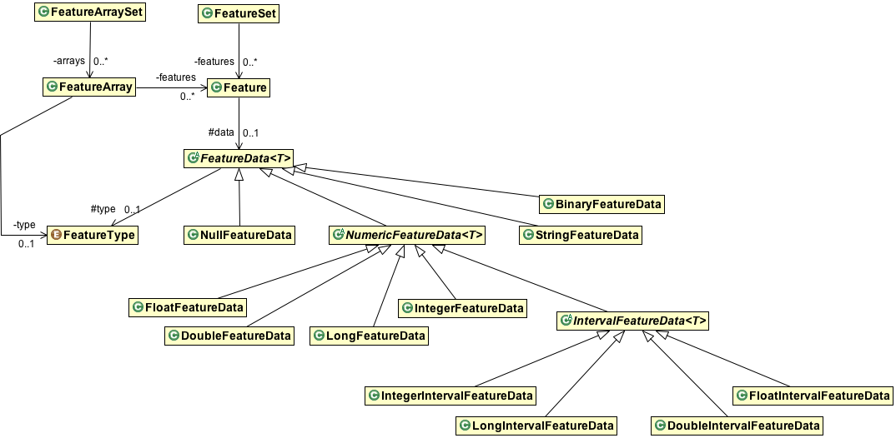

Package: galileo.dataset.feature
================================

This package implements Galileo datatypes, which consists of a subset of Java primitives along with some additional functionality such as first-class support for intervals.

Features can be managed as multidimensional non-jagged arrays using *FeatureArray* or be stored as a collection of 1D attributes using a *FeatureSet*.

Feature types supported by the system are enumerated in _FeatureType_.

